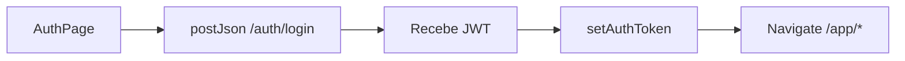
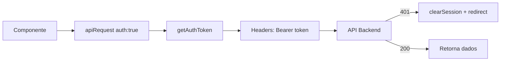
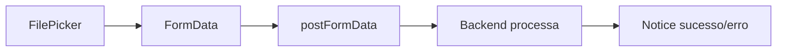

# Arquitetura - MailOps Web

## Visão Geral

Este documento descreve a arquitetura técnica da aplicação MailOps Web, construída com React, seguindo princípios de modularização e separação de responsabilidades.

## Princípios Arquiteturais

- **Modularização por Domínio** - Organização por contextos de negócio
- **Separação de Responsabilidades** - Componentes, lógica e estilos isolados
- **DRY (Don't Repeat Yourself)** - Reutilização via módulo `shared`
- **Single Responsibility** - Cada módulo com uma responsabilidade clara

## Estrutura de Diretórios

```
src/
├── app/                    # Configuração da aplicação
│   ├── layouts/           # Layouts reutilizáveis (App, Auth, Marketing, Root)
│   ├── App.jsx           # Componente raiz
│   └── router.jsx        # Configuração de rotas e ProtectedRoute
│
├── modules/               # Módulos de domínio
│   ├── auth/             # Autenticação e autorização
│   │   └── pages/        # AuthPage, ResetPasswordPage
│   ├── inbox/            # Análise de emails
│   │   └── pages/        # AnalyzePage
│   └── marketing/        # Landing page pública
│       └── pages/        # LandingPage
│
├── shared/               # Recursos compartilhados
│   ├── components/       # Componentes reutilizáveis
│   │   ├── FilePicker.jsx        # Upload de arquivos
│   │   ├── Footer.jsx            # Rodapé global
│   │   ├── Navbar.jsx            # Menu de navegação
│   │   ├── Notice.jsx            # Sistema de notificações
│   │   ├── SessionTimeout.jsx   # Gerenciamento de timeout
│   │   └── Tag.jsx               # Tags visuais
│   ├── lib/              # Bibliotecas e utilitários
│   │   ├── apiClient.js  # Cliente HTTP centralizado
│   │   ├── auth.js       # Funções de autenticação
│   │   ├── jwt.js        # Manipulação de tokens JWT
│   │   └── storage.jsx   # Gerenciamento de localStorage
│   └── styles/           # Estilos globais
│       └── global.css
│
├── assets/               # Recursos estáticos
│   ├── images/          # Imagens (backgrounds, logo)
│   └── logoMini.svg     # Logo SVG
│
└── main.jsx             # Ponto de entrada da aplicação
```

## Módulos de Domínio

### Auth (`modules/auth`)

**Responsabilidade:** Gerenciamento de autenticação e autorização

**Páginas:**

- `AuthPage.jsx` - Login e registro de usuários
- `ResetPasswordPage.jsx` - Recuperação de senha

### Inbox (`modules/inbox`)

**Responsabilidade:** Análise e processamento de emails

**Páginas:**

- `AnalyzePage.jsx` - Upload e análise de PDFs (protegida)

### Marketing (`modules/marketing`)

**Responsabilidade:** Conteúdo público e conversão

**Páginas:**

- `LandingPage.jsx` - Página inicial pública

## Módulo Shared

### Components

Componentes UI reutilizáveis em toda aplicação:

| Componente       | Descrição                        |
| ---------------- | -------------------------------- |
| `FilePicker`     | Upload de arquivos drag-and-drop |
| `Footer`         | Rodapé com links e informações   |
| `Navbar`         | Menu de navegação responsivo     |
| `Notice`         | Sistema de notificações toast    |
| `SessionTimeout` | Monitoramento de inatividade     |
| `Tag`            | Tags visuais categorizadas       |

### Lib

Bibliotecas e utilitários centralizados:

#### `apiClient.js`

Cliente HTTP com funcionalidades:

- Configuração automática de base URL e API Key
- Interceptação de autenticação (Bearer token)
- Tratamento de erros padronizado
- Auto-logout em 401
- Suporte a JSON e FormData

**Principais Funções:**

```javascript
apiRequest(path, options); // Request genérica
getJson(path, options); // GET request
postJson(path, payload); // POST JSON
postFormData(path, form); // POST FormData
```

#### `auth.js`

Lógica de autenticação:

- Validação de tokens
- Verificação de expiração
- Gerenciamento de sessão

#### `jwt.js`

Manipulação de tokens JWT:

- Decodificação de payload
- Extração de claims
- Validação de estrutura

#### `storage.jsx`

Abstração de localStorage:

- `getAuthToken()` / `setAuthToken()`
- `clearSession()`
- Persistência segura de dados

## Sistema de Rotas

### Configuração (`app/router.jsx`)

```javascript
/                    → LandingPage (pública)
/auth                → AuthPage (pública)
/reset-password      → ResetPasswordPage (pública)
/app/analyze         → AnalyzePage (protegida)
```

### ProtectedRoute

Componente HOC que:

- Verifica existência de token
- Redireciona para `/auth?mode=login` se não autenticado
- Renderiza children se autenticado

## Layouts

| Layout            | Descrição                    | Uso                    |
| ----------------- | ---------------------------- | ---------------------- |
| `RootLayout`      | Layout base da aplicação     | Todas as páginas       |
| `MarketingLayout` | Layout para páginas públicas | Landing Page           |
| `AuthLayout`      | Layout para autenticação     | Login, Registro, Reset |
| `AppLayout`       | Layout para área autenticada | Dashboard, Análise     |

## Segurança

### Autenticação

- **Tipo:** JWT (JSON Web Token)
- **Storage:** localStorage
- **Header:** `Authorization: Bearer {token}`
- **API Key:** `X-API-Key` header

### Proteções

1. **Rotas Privadas:** `ProtectedRoute` wrapper
2. **Session Timeout:** Componente global de inatividade
3. **Auto Logout:** Em resposta 401
4. **Token Validation:** Verificação de expiração no client

## Fluxo de Dados

### Autenticação



### Request Autenticada



### Upload de Arquivo



## Comunicação com Backend

### Base URL

Configurada via `VITE_API_BASE_URL` (padrão: `http://localhost:8000`)

### Headers Padrão

```http
X-API-Key: {VITE_PUBLIC_API_KEY}
Authorization: Bearer {jwt_token}  # apenas em requests auth:true
Content-Type: application/json     # automático em postJson
```

### Tratamento de Erros

1. Parse de `response.detail` ou `response.message`
2. Criação de Error com `.status` property
3. Componente Notice exibe mensagem ao usuário

## Build e Deploy

### Desenvolvimento

```bash
npm run dev  # Vite dev server (porta 5173)
```

### Produção

```bash
npm run build   # Gera dist/
npm run preview # Preview local da build
```

### Variáveis de Ambiente

- `VITE_PUBLIC_API_KEY` - API Key pública
- `VITE_API_BASE_URL` - URL base da API

## Padrões de Código

### Convenções

- **Componentes:** PascalCase (`.jsx`)
- **Utilitários:** camelCase (`.js`)
- **Módulos:** Singular (`auth`, `inbox`)
- **Páginas:** Sufixo `Page.jsx`

### Organização Interna de Componente

```javascript
// 1. Imports
import { useState } from "react";
import { apiClient } from "../../shared/lib/apiClient";

// 2. Component
export default function MyComponent() {
  // 3. Hooks
  const [state, setState] = useState();

  // 4. Handlers
  const handleAction = () => {};

  // 5. Render
  return <div>...</div>;
}
```

### Escalabilidade

- **State Management:** Considerar Context API ou Zustand para estado global
- **Code Splitting:** Implementar lazy loading por rota
- **Cache:** Implementar React Query para cache de requisições

---

**Última Atualização:** 2026-01-16
